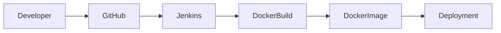
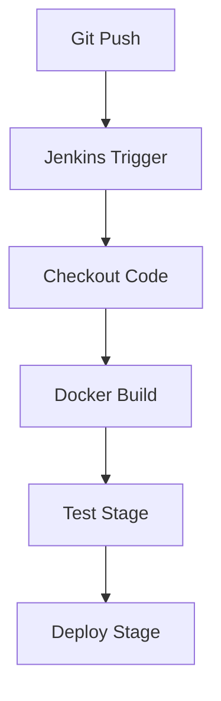
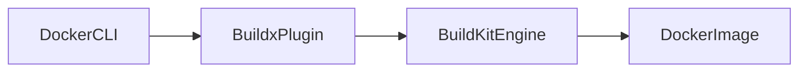
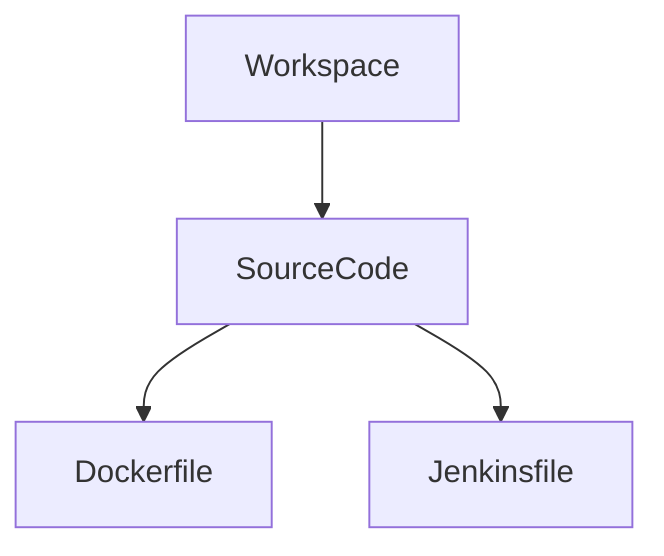

<!-- 🚀 ULTRA CI/CD BANNER -->

<p align="center">

</p>

---

# 🚀 Jenkins CI/CD Pipeline with Docker on Ubuntu

<h3 align="center">Production Style DevOps CI/CD Implementation</h3>

---

<p align="center">


</p>

---

# 👨‍💻 Project Owner

**Arkan Tandel**  
DevOps Engineer | Cloud Automation Enthusiast 🚀  

GitHub → https://github.com/arkantandel  
LinkedIn → https://linkedin.com/in/arkan-tandel  

---

# 🌟 Project Vision

This project demonstrates **real-world CI/CD pipeline implementation** using Jenkins and Docker on Ubuntu running inside AWS EC2.

This is not just setup —  
This represents **real DevOps troubleshooting + pipeline design + production mindset**.

---

# 📌 Project Goal

✔ Automate Build Process  
✔ Containerize Application  
✔ Integrate GitHub → Jenkins → Docker  
✔ Prepare for Cloud Deployment  
✔ Solve Real Production Errors  

---

# 🏗️ High Level CI/CD Architecture



---

# 🔄 Pipeline Execution Flow



---

# 🧩 Technology Stack

| Tool | Purpose |
|---|---|
Jenkins | CI/CD Automation |
Docker | Containerization |
Docker Buildx | Advanced Build Engine |
GitHub | Source Code |
Ubuntu | CI/CD Host OS |
AWS EC2 | Cloud Infrastructure |

---

# ⚙ Jenkins Installation (Ubuntu)

```bash
sudo apt update
sudo apt install openjdk-17-jdk -y
```

```bash
sudo apt install jenkins -y
sudo systemctl enable jenkins
sudo systemctl start jenkins
```

---

# 🐳 Docker Installation

```bash
sudo apt install docker.io -y
sudo systemctl enable docker
sudo systemctl start docker
```

---

# 🔑 Critical Production Fix — Docker Permission

### ❌ Error
permission denied while connecting to Docker daemon

### ✅ Solution

```bash
sudo usermod -aG docker jenkins
sudo systemctl restart jenkins
```

---

# 🧱 Docker Buildx Architecture



---

# 📂 Jenkins Workspace Structure



---

# 📜 Jenkins Pipeline (Declarative)

```groovy
pipeline {
 agent any

 stages {
  stage('Checkout') {
   steps {
    git url: 'https://github.com/arkantandel/...git'
   }
  }

  stage('Build') {
   steps {
    sh 'docker build -t notes-app:latest .'
   }
  }

  stage('Test') {
   steps {
    echo 'Testing Phase'
   }
  }

  stage('Deploy') {
   steps {
    echo 'Future Deployment Stage'
   }
  }
 }
}
```

---

# ❌ Real Errors I Faced (Production Style)

### Docker Permission Issue  
Solved using Docker group access  

### Build Context Error  
Fixed build path  

### Buildx Plugin Error  
Reinstalled plugin properly  

---

# 🧠 Jenkins Internal Execution


---

# 🛠 Real Commands I Executed

### System Prep
```bash
sudo apt update && sudo apt upgrade -y
```

---

### Docker Install
```bash
sudo apt install docker-ce docker-ce-cli containerd.io -y
```

---

### Jenkins Install
```bash
sudo apt install jenkins -y
```

---

### Jenkins Docker Permission
```bash
sudo usermod -aG docker jenkins
```

---

# 🌟 What This Project Proves

✔ Real CI/CD Implementation  
✔ Real Troubleshooting Skills  
✔ Linux Permission Understanding  
✔ Docker Internal Knowledge  
✔ Production Pipeline Thinking  

---

# 🚀 Future Enterprise Improvements

✔ Push Image → AWS ECR  
✔ Deploy → ECS / Kubernetes  
✔ Add Automated Tests  
✔ Add Security Scan  

---

# ❤️ DevOps Philosophy

> CI/CD is not about automation only.  
> It is about reliability, speed, and confidence in deployments.

---

<!-- FOOTER -->

<p align="center">

</p>

